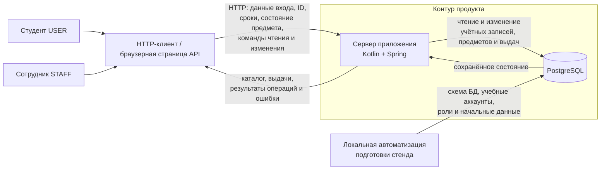

# Модель угроз

Модель относится к текущей версии продукта «Стафф» и построена по актуальным
[`PROJECT.md`](../PROJECT.md) и
[`docs/security-requirements.md`](security-requirements.md).

Цель модели — показать, каким реалистичным способом могут быть нарушены свойства,
зафиксированные в `SR-*`, и выделить угрозы, которые должны повлиять на
проектные решения на S04.

> Источником истины для этой версии модели являются документы, находящиеся в
> командном репозитории. Если сценарии, роли, состояния или API меняются,
> сначала согласованно обновляются паспорт и требования безопасности, после
> чего пересматриваются затронутые `T-*`.

## 1. Модель продукта

### 1.1. Архитектурный вид

Текущая версия предусматривает один сервер приложения и одну базу данных.

Главная публичная точка входа — HTTP API. Пользователь управляет HTTP-клиентом
и может сформировать запрос независимо от ограничений пользовательского
интерфейса. Сервер приложения самостоятельно принимает решения об
аутентификации, роли, принадлежности выдачи, допустимости изменения состояния и
согласованности предметной операции.

Прямой доступ пользовательского клиента к PostgreSQL не предусмотрен. База
данных изменяется сервером приложения и локальной процедурой подготовки стенда.

### 1.2. Что уже существует

На момент S03 в репозитории зафиксированы:

- паспорт продукта `PROJECT.md`;
- требования безопасности `SR-01`–`SR-11`;
- роли `USER` и `STAFF`, их полномочия и два основных сквозных сценария;
- планируемый технологический стек;
- правила локального учебного стенда.

После S04 добавлена запускаемая основа Spring Boot с PostgreSQL, миграциями
Liquibase, JPA-сущностями учетной записи, предмета и выдачи. Отдельный скрипт
добавляет три предмета. Предметные HTTP-операции и вход пока не реализованы.
Запуск и границы текущей проверки описаны в [README.md](../README.md).

### 1.3. Что пока планируется

Планируется реализовать:

- предметные операции HTTP API на Kotlin/JVM и Spring Boot;
- вход под учебными учётными записями;
- проверку роли и принадлежности выдачи;
- каталог экземпляров;
- оформление выдачи и возврата;
- работу предметных операций с уже созданной схемой PostgreSQL;
- подготовку учебных аккаунтов;
- ограничение попыток входа;
- безопасное хранение паролей;
- защищённый транспорт для случая удалённого доступа.

Конкретные механизмы реализации перечисленных свойств являются предметом
последующих проектных решений `D-*` и в S03 заранее не фиксируются.

### 1.4. Существенные допущения

1. Рассматривается одна учебная организация и один пункт выдачи.
2. Публичная регистрация, восстановление пароля, SSO, загрузка файлов,
   платежи, QR-коды, уведомления и мобильное приложение отсутствуют.
3. Учебные аккаунты и роли создаются процедурой подготовки стенда, а не
   публичным API.
4. Клиентская сторона недоверенна: отсутствие кнопки или скрытое поле в UI не
   мешает пользователю отправить произвольный HTTP-запрос.
5. Знание идентификатора предмета или выдачи не подтверждает право доступа или
   право изменения.
6. Для локального стенда HTTP допустим только при условии, что API недоступен
   другим устройствам. При удалённом доступе действуют требования `SR-09`.
7. Время предметных событий определяется серверной стороной.
8. Текущий паспорт описывает оформление сотрудником сразу активной выдачи и
   последующий возврат. Другие состояния и переходы не включаются в эту модель,
   пока они не появятся в актуальных `PROJECT.md` и `security-requirements.md`.

## 2. Границы доверия

| ID | Граница | Что пересекает | Почему требуется проверка |
| --- | --- | --- | --- |
| `TB-01` | Пользовательский клиент и сеть → сервер приложения | Логин и пароль, идентификаторы предметов и выдач, параметры чтения, получатель, срок, состояние предмета, команды изменения; в обратную сторону — каталог, выдачи и результаты операций | Клиент управляется пользователем, а при удалённом доступе сеть также нельзя считать доверенной. Корректный формат запроса не доказывает полномочия, принадлежность объекта или допустимость операции. Сервер обязан сам установить пользователя, роль, право на объект и допустимость изменения. |
| `TB-02` | Локальная автоматизация подготовки стенда → PostgreSQL | Схема БД, учебные аккаунты, роли, начальные данные и сохранённые проверочные значения паролей | Процедура подготовки стенда имеет привилегированный путь записи, минующий публичный API. Ошибка в ней способна создать неверные роли, слабые данные проверки пароля или некорректное исходное состояние. |

Связь сервер приложения → PostgreSQL является внутренней границей компонентов,
но в текущей модели не выделяется как отдельная граница доверия: оба компонента
относятся к серверному контуру продукта. При этом атомарность и ограничения БД
остаются существенными для угроз согласованности `T-05` и `T-06`.

## 3. Значимые объекты и свойства

Основные объекты определены в разделе 5 `PROJECT.md`; отдельный реестр активов
для S03 не создаётся.

Для модели угроз существенны следующие свойства:

- **учётная запись** — нельзя позволить войти от имени другого пользователя,
  назначить себе роль или раскрыть данные проверки пароля;
- **выдача** — студент не должен видеть чужие записи; получатель, предмет,
  исходные сведения и история возврата не должны произвольно подменяться;
- **экземпляр имущества** — нельзя допустить одновременно несколько активных
  выдач одного экземпляра или выдачу предмета без допуска;
- **история операций** — завершённая выдача не должна переписываться повторным
  или запоздалым запросом;
- **секреты и диагностические данные** — пароли, сохранённые проверочные
  значения, ключи и внутренние детали ошибок не должны раскрываться;
- **сетевой обмен** — при удалённом доступе третья сторона не должна читать или
  незаметно изменять данные входа и предметные операции.

## 4. Угрозы

| ID | Сценарий угрозы | Что нарушается | Граница / точка входа | Связанные SR | Приоритет и обоснование |
| --- | --- | --- | --- | --- | --- |
| `T-01` | Неаутентифицированный пользователь напрямую вызывает чтение каталога или выдач либо предметную операцию. Если для отдельного маршрута отсутствует обязательная проверка входа, сервер возвращает данные или выполняет действие без установленной личности пользователя. | Требование обязательной аутентификации; конфиденциальность предметных данных и возможность безопасно связывать действие с пользователем. | `TB-01`, любой защищённый маршрут API | `SR-01` | **Высокий, приоритетный.** Это нарушение основной границы доверия: атакующему не нужны ни чужой ID, ни повышенная роль. Ошибка конфигурации одного маршрута способна открыть данные или операции полностью без входа. |
| `T-02` | Аутентифицированный студент формирует прямой запрос к операции сотрудника — изменению каталога или допуска, выбору получателя, оформлению выдачи либо возврата — и при необходимости добавляет в тело или параметры `role=STAFF`. Если сервер доверится UI или клиентскому полю роли, студент получает полномочия сотрудника. | Разграничение полномочий и целостность каталога и выдач. | `TB-01`, staff-only операции API | `SR-02` | **Высокий, приоритетный.** Прямой вызов API полностью реалистичен и затрагивает основные сценарии продукта; проверка роли должна быть серверной и системной. |
| `T-03` | Аутентифицированный студент подставляет известный или подобранный идентификатор чужой выдачи в путь, фильтр или другой параметр. Если сервер проверяет существование записи, но не её получателя, студент получает чужую запись либо узнаёт её наличие по отличающемуся ответу. | Конфиденциальность выдач и изоляция данных между студентами. | `TB-01`, чтение списка и отдельной выдачи | `SR-03` | **Высокий, приоритетный.** Идентификатор — недоверенный ввод, а сценарий доступен обычному `USER`. Нарушается прямое правило продукта о доступе только к собственным выдачам. |
| `T-04` | Клиент при оформлении выдачи или возврата добавляет серверные поля — другого исполнителя, время операции — либо пытается изменить получателя, экземпляр, срок или исходное состояние уже оформленной выдачи. Если сервер массово связывает входные поля с моделью данных или не отбрасывает запрещённые поля, история становится недостоверной. | Целостность и достоверность истории: кто выполнил действие, когда оно произошло и к какому предмету и получателю относится. | `TB-01`, оформление выдачи и возврата | `SR-04` | **Высокий.** Используется обычная поверхность основной операции; последствия включают ложного получателя, подмену объекта или искажение истории. |
| `T-05` | Два сотрудника почти одновременно оформляют выдачу одного свободного экземпляра разным студентам. Оба запроса успевают прочитать предмет как свободный до сохранения первого результата. Если проверка доступности и создание выдачи не согласованы атомарно, появляются две активные выдачи одного предмета. Аналогично сбой между фиксацией возврата и изменением допуска может оставить частичное состояние. | Уникальность активной выдачи, целостность учёта и атомарность изменения связанных данных. | `TB-01`, создание выдачи; внутренняя запись состояния в PostgreSQL | `SR-05` | **Высокий, приоритетный.** Угроза возникает из двух корректных запросов и затрагивает центральный инвариант продукта. Она должна повлиять на решения по транзакциям и ограничениям состояния. |
| `T-06` | После успешного возврата старый запрос возврата отправляется повторно либо два возврата приходят одновременно. Если сервер не проверяет текущее состояние конкретной выдачи в момент изменения, повтор может переписать дату или сотрудника, повторно изменить допуск предмета либо повлиять на более позднее состояние экземпляра. | Неизменность завершённой истории и корректность текущего состояния предмета. | `TB-01`, операция возврата; внутренняя запись состояния в PostgreSQL | `SR-06` | **Высокий, приоритетный.** Повтор возможен и без злого умысла из-за повторной отправки запроса. Последствия затрагивают историю и последующие выдачи физического предмета. |
| `T-07` | Сотрудник изменяет допуск предмета, а конкурентный запрос оформляет выдачу на основе устаревшего состояния. Если сервер не проверяет актуальный допуск при сохранении выдачи, предмет, отмеченный как требующий проверки, оказывается выдан студенту. | Запрет выдачи предмета без допуска и согласованность текущего состояния. | `TB-01`, изменение допуска и создание выдачи; сохранение в БД | `SR-07`, `SR-05` | **Высокий.** Нарушение затрагивает физический предмет и один из основных предметных запретов. Частично пересекается с `T-05`, поэтому отдельно не включается в приоритетный набор. |
| `T-08` | Пользователь провоцирует некорректный запрос или внутреннюю ошибку, а сервер возвращает SQL, stack trace, секрет конфигурации, данные проверки пароля или другие внутренние сведения. Отдельный путь того же риска — случайное добавление действующего секрета в репозиторий. | Конфиденциальность секретов и внутренних деталей; снижение барьера для последующих атак. | `TB-01`, обработка ошибок; конфигурация и история Git | `SR-08` | **Высокий.** Раскрытие секрета может превратить информационную ошибку в компрометацию учётной записи или серверного контура. Угроза должна учитываться до появления реальных секретов. |
| `T-09` | При удалённом доступе клиент использует HTTP либо принимает недействительный сертификат. Посредник в сети перехватывает логин и пароль, читает ответы с выдачами или изменяет предметный запрос сотрудника. | Конфиденциальность и целостность сетевого обмена, а вслед за ними подлинность пользователя и корректность операции. | `TB-01`, сетевой участок клиент → API | `SR-09`, `SR-01`, `SR-04` | **Средний** для изолированного локального стенда и **высокий** перед удалённым доступом. В текущем локальном режиме поверхность ограничена, но при публикации API сценарий становится непосредственно реализуемым. |
| `T-10` | Атакующий получает дамп PostgreSQL или резервную копию с сохранёнными значениями паролей. Если используется открытый текст, обратимое шифрование или быстрый хеш без индивидуальной соли и достаточной стоимости, атакующий выполняет офлайн-подбор и восстанавливает пароли. | Конфиденциальность учётных данных и последующая возможность входа как `USER` или `STAFF`. | Хранилище учётных записей, `TB-02` и серверный контур БД | `SR-10`, косвенно `SR-01` | **Высокий.** После утечки БД онлайн-ограничение попыток входа не помогает: подбор выполняется офлайн. Особенно серьёзна компрометация пароля сотрудника. |
| `T-11` | Неаутентифицированный пользователь многократно отправляет попытки входа для одного логина. Если число попыток не ограничено, возможен онлайн-подбор пароля; если ответы для неизвестного логина и неверного пароля отличаются до срабатывания лимита, атакующий сначала определяет существующие аккаунты и затем концентрирует перебор на них. | Стойкость аутентификации и сокрытие существования учебной учётной записи. | `TB-01`, endpoint входа | `SR-11`, `SR-01` | **Средний** для закрытого локального стенда и **высокий** при удалённой доступности. Атака проста и не требует учётной записи, но её практическая поверхность сейчас ограничена локальным режимом. |

## 5. Приоритетный набор для S04

Для последующих проектных решений выбираются:

- `T-01` — доступ к защищённым данным или операциям без аутентификации;
- `T-02` — прямой вызов staff-only операций и попытка повысить полномочия;
- `T-03` — доступ студента к чужой выдаче по идентификатору;
- `T-05` — двойная выдача и частичное состояние при конкурентных операциях;
- `T-06` — повторный или конкурентный возврат с искажением истории.

Этот набор выбран потому, что угрозы относятся к основной границе доверия и двум
сквозным сценариям — выдаче и возврату. Они затрагивают установление личности,
полномочия, принадлежность данных и наиболее важные инварианты состояния. Все
пять должны влиять на архитектурные решения уже при создании серверной основы.

Остальные `T-*` сохраняются в модели. Их отсутствие в текущем приоритетном
наборе не отменяет соответствующие `SR-*`. Перед открытием стенда для
удалённого доступа необходимо повторно оценить `T-09` и `T-11`.

## 6. Проверка покрытия требований

Связи уже указаны непосредственно в строках угроз; отдельная матрица
трассировки для S03 не требуется. Для самопроверки набор покрывает требования
S02 следующим образом:

- `SR-01` → `T-01`, `T-09`, `T-11`, косвенно `T-10`;
- `SR-02` → `T-02`;
- `SR-03` → `T-03`;
- `SR-04` → `T-04`, `T-09`;
- `SR-05` → `T-05`, `T-07`;
- `SR-06` → `T-06`;
- `SR-07` → `T-07`;
- `SR-08` → `T-08`;
- `SR-09` → `T-09`;
- `SR-10` → `T-10`;
- `SR-11` → `T-11`.

Секция нужна как самопроверка полноты. Основными рабочими связями остаются
`T-* → SR-*` в таблице угроз.

## 7. Разрывы и вопросы к следующему этапу

До S04 необходимо:

1. сохранить устойчивые ID `T-01`–`T-11`, пока смысл соответствующих угроз не
   меняется;
2. связать будущие `D-*` как минимум со всем приоритетным набором
   `T-01`, `T-02`, `T-03`, `T-05`, `T-06`;
3. при изменении API, ролей, процесса выдачи/возврата или схемы аутентификации
   пересмотреть затронутые угрозы и границы доверия;
4. при переходе от изолированного локального стенда к сетевому доступу
   пересмотреть приоритеты `T-09` и `T-11`;
5. проверить, что процедура подготовки стенда не создаёт роли или данные
   проверки паролей способом, противоречащим `SR-08` и `SR-10`.

На S03 намеренно не фиксируются конкретные защитные механизмы. Они должны быть
обоснованы на S04 как проектные решения, связанные с выбранными угрозами и
требованиями безопасности.
